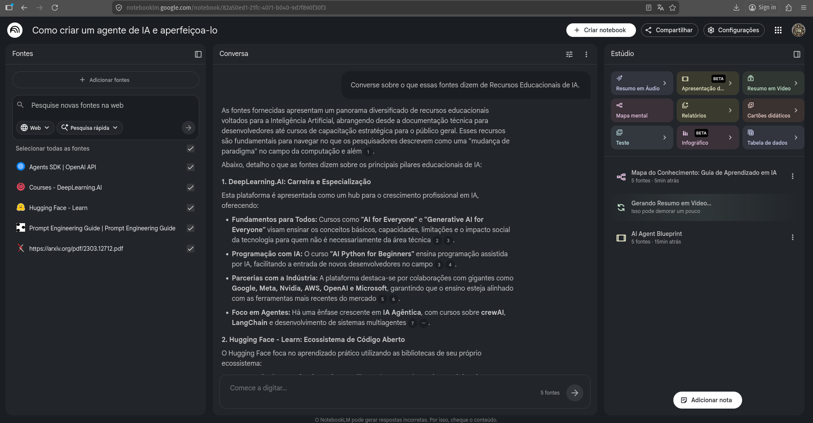

# 📘 Caderno Temático com NotebookLM: Estudo sobre Agentes de IA
Criação e aperfeiçoamento de agentes de IA com NotebookLm

---
## 📸 Evidência do uso do NotebookLM

A imagem abaixo demonstra o uso do NotebookLM durante o processo de estudo, incluindo a análise das fontes e a interação com a IA.

## 📌 Contexto e Objetivos

Este projeto foi desenvolvido como parte de um desafio da DIO com o objetivo de utilizar Inteligência Artificial como ferramenta de aprendizagem ativa.

O tema escolhido foi a criação e aperfeiçoamento de agentes de IA, utilizando o NotebookLM para organizar o conhecimento e explorar diferentes abordagens de aprendizado.

### 🎯 Objetivos

* Utilizar o NotebookLM como ferramenta de estudo
* Desenvolver pensamento crítico
* Melhorar a qualidade dos prompts
* Organizar conhecimento de forma estruturada

---

## 📚 Curadoria de Fontes

1. https://platform.openai.com/docs/guides/agents
2. https://www.promptingguide.ai/
3. https://arxiv.org/pdf/2303.12712.pdf
4. https://huggingface.co/learn
5. https://www.deeplearning.ai/

---

## ⚙️ Engenharia de Prompts e Cicatrizes

### Prompt 1

"O que é um agente de IA?"
➡️ Resposta genérica

### Prompt 2

"Explique com exemplos"
➡️ Melhor, mas superficial

### Prompt 3

"Explique com definição, arquitetura, tipos e aplicações com base nas fontes"
➡️ Resposta completa

### Cicatrizes

* Prompts genéricos não funcionam bem
* Necessário dar contexto
* Iteração foi essencial

---

## 📘 Miniguia de Estudo

### O que é um agente de IA

Sistema que recebe dados e toma decisões.

### Como funciona

Entrada → processamento → saída

### Tipos

Reativos, baseados em modelo, objetivos e aprendizado

### Aplicações

Chatbots, automação e assistentes

---

## 📖 Glossário

* Prompt
* LLM
* Token
* Contexto

---

## 🧰 Prompts Reutilizáveis

Explique [tema] com exemplos
Aprofunde [tema] com base nas fontes
Resuma [tema] destacando pontos principais

---
